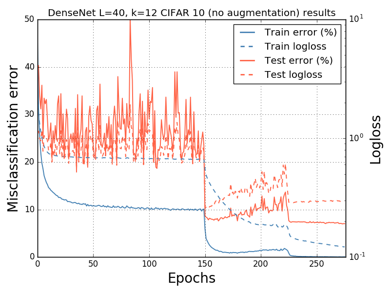

# Keras Implementation of DenseNet

Original idea and implementation:

[Densely Connected Convolutional Network](http://arxiv.org/abs/1608.06993)

The figures below are taken from the paper above.

Figure 1: A dense block with 5 layers and growth rate 4.

Figure 2: A deep DenseNet with three dense blocks. 

# Results:

Below, results obtained with a network of depth 40, growth rate 12, 3 dense blocks, dropout rate of 0.2 and trained with SGD for 276 epochs.

All convolutional layer have `bias = False` meaning we don't use a bias parameter for them.

Weight decay (1E-4) is applied to convolutional layers, batch norm parameters and the last dense layer.

The initial learning rate is 0.1 and the learning rate is divided by 10 after 150 and 225 epochs.

These settings lead to the same results as [Densely Connected Convolutional Network](http://arxiv.org/abs/1608.06993): 7 % misclassification rate on the CIFAR10 test set without data augmentation.

# Running a CIFAR10 experiment

python run_cifar10.py

optional arguments:
    -h, --help            show this help message and exit
    --batch_size BATCH_SIZE
                          Batch size
    --nb_epoch NB_EPOCH   Number of epochs
    --depth DEPTH         Network depth
    --nb_dense_block NB_DENSE_BLOCK
                          Number of dense blocks
    --nb_filter NB_FILTER
                          Initial number of conv filters
    --growth_rate GROWTH_RATE
                          Number of new filters added by conv layers
    --dropout_rate DROPOUT_RATE
                          Dropout rate
    --learning_rate LEARNING_RATE
                          Learning rate
    --weight_decay WEIGHT_DECAY
                          L2 regularization on weights
    --plot_architecture PLOT_ARCHITECTURE
                          Save a plot of the network architecture

# Architecture

With two dense blocks and 2 convolution operations within each block, the model looks like this:

