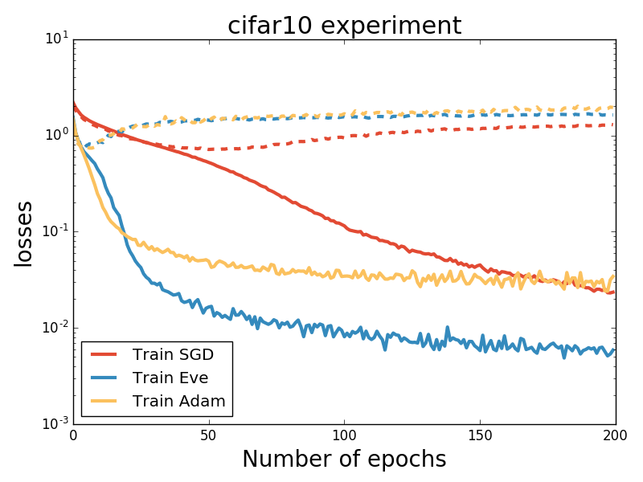
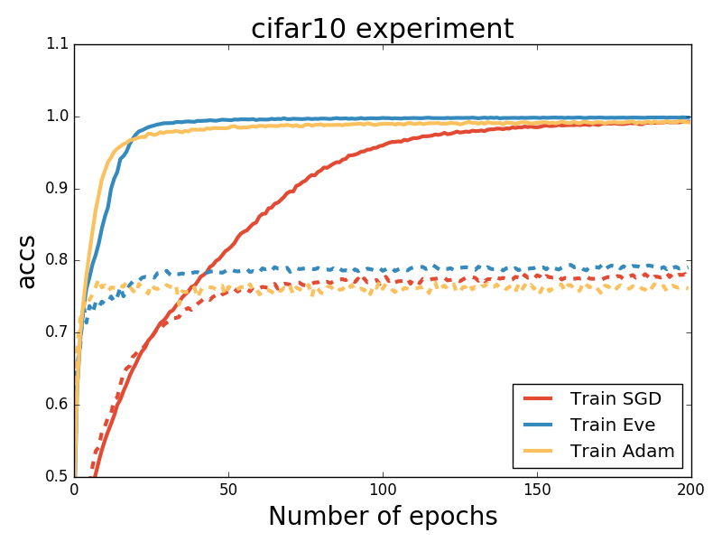
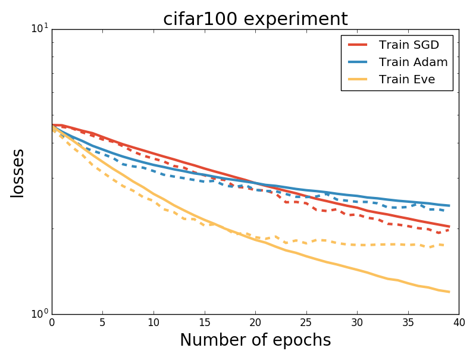
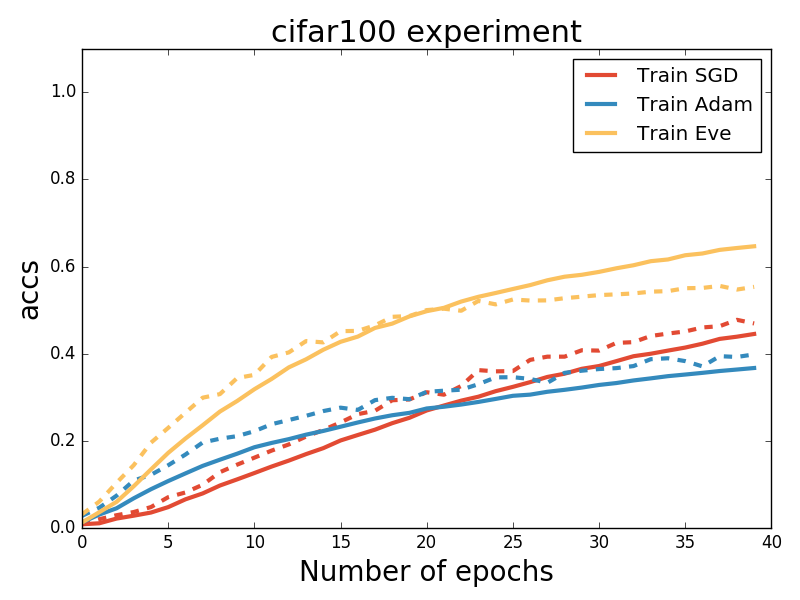

# Implementation of the Eve optimizer

This is a keras implementation of [Improving Stochastic Gradient Descent With Feedback](https://arxiv.org/pdf/1611.01505v1.pdf).

Check [this page](https://github.com/jayanthkoushik/sgd-feedback/blob/master/src/eve.py) for the authors' original implementation of Eve.

## Usage

You can either import this optimizer:

    from Eve import Eve
    Eve_instance = Eve(lr=0.001, beta_1=0.9, beta_2=0.999,
                        beta_3=0.999, small_k=0.1, big_K=10,
                        epsilon=1e-8)

Or copy the Eve class to keras/optimizers.py and use it as any other optimizer.

## Experiments:

Run: `python main.py`

positional arguments:

    list_experiments      List of experiment names. E.g. Eve SGD Adam --> will
                        run a training session with each optimizer

optional arguments:

      -h, --help            show this help message and exit
      --model_name MODEL_NAME
                            Model name: CNN, Big_CNN or FCN
      --batch_size BATCH_SIZE
                            Batch size
      --nb_epoch NB_EPOCH   Number of epochs
      --dataset DATASET     Dataset, cifar10, cifar100 or mnist

## Results

Running `python main.py SGD Adam Eve --model_name CNN --nb_epoch 200 --dataset cifar10`, we obtained:

For this experiment, the configuration of the optimizers was:

    opt = SGD(lr=1E-3, decay=0, momentum=0.9, nesterov=True)
    opt = Adam(lr=1E-3, decay=0, beta_1=0.9, beta_2=0.999, epsilon=1e-08)
    opt = Eve(lr=1E-3, decay=0, beta_1=0.9, beta_2=0.999, beta_3=0.999, small_k=0.1, big_K=10, epsilon=1e-08)

which shows that for this one experiment (no hyperparameter grid search) the training metric converges faster and to a better optimum with Eve.

Running `python main.py SGD Adam Eve --model_name Big_CNN --nb_epoch 100 --dataset cifar100` --nb_epoch 40, we obtained:

For this experiment, the configuration of the optimizers was:

    opt = SGD(lr=1E-2, decay=1E-4, momentum=0.9, nesterov=True)
    opt = Adam(lr=1E-4, decay=1E-4, beta_1=0.9, beta_2=0.999, epsilon=1e-08)
    opt = Eve(lr=1E-4, decay=1E-4, beta_1=0.9, beta_2=0.999, beta_3=0.999, small_k=0.1, big_K=10, epsilon=1e-08)

