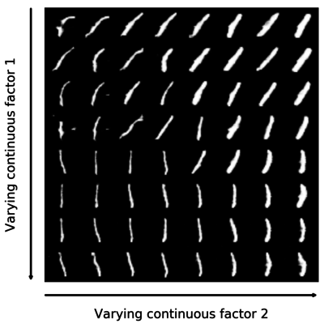

# InfoGAN

Keras implementation of [InfoGAN: Interpretable Representation Learning by Information Maximizing Generative Adversarial Nets](https://arxiv.org/abs/1606.03657)

# Requirements

## python modules

- keras, theano or tensorflow backend
- h5py
- matplotlib
- opencv 3
- numpy
- tqdm
- parmap

# Part 1. Processing the data

Follow [these instructions](https://github.com/tdeboissiere/DeepLearningImplementations/tree/master/InfoGAN/src/data).

# Part 2. Running the code

Follow [these instructions](https://github.com/tdeboissiere/DeepLearningImplementations/tree/master/InfoGAN/src/model)

# Part 3. Example results

**MNIST example results**

Varying the categorical code:

Getting there but not perfect

Varying the continuous code:

(the codes are samples from a grid column wise x row wise)

It seems that a combination of the two codes rather than one in isolation leads to a change of thickness / orientation